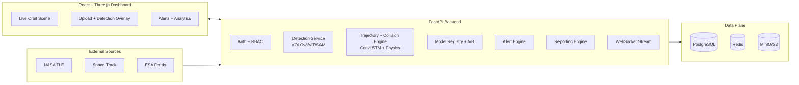

# Architecture

## System Overview (Mermaid)

## Core Runtime Path

1. Incoming frame or video chunk enters detection pipeline.
2. Detection boxes and uncertainty scores are emitted.
3. Tracker updates object histories and velocity vectors.
4. Collision engine computes closest approach and impact time.
5. Alerts and analytics are pushed via WebSocket + persisted stores.
